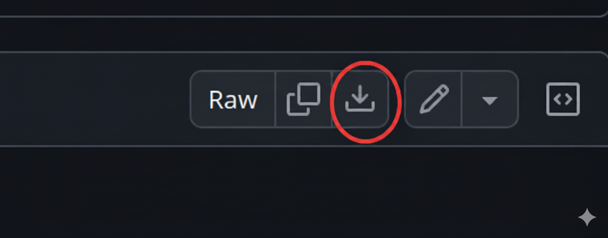
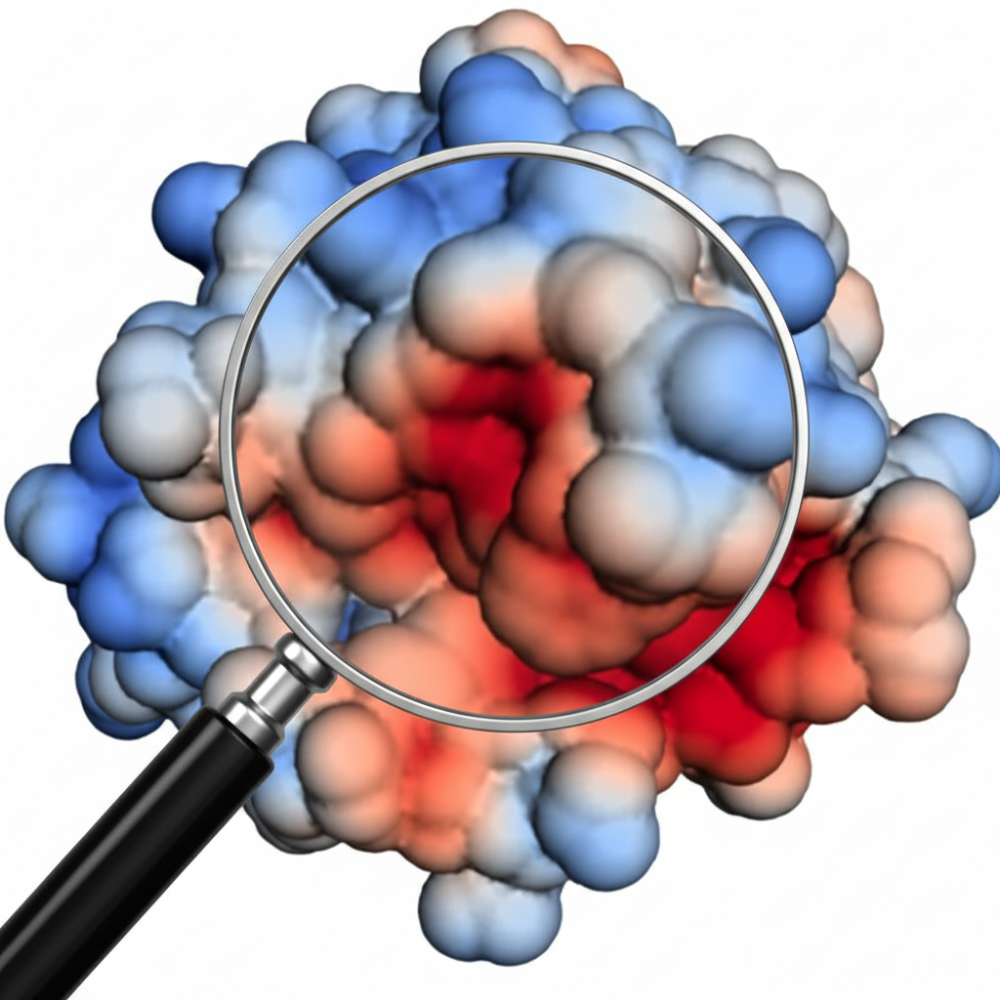
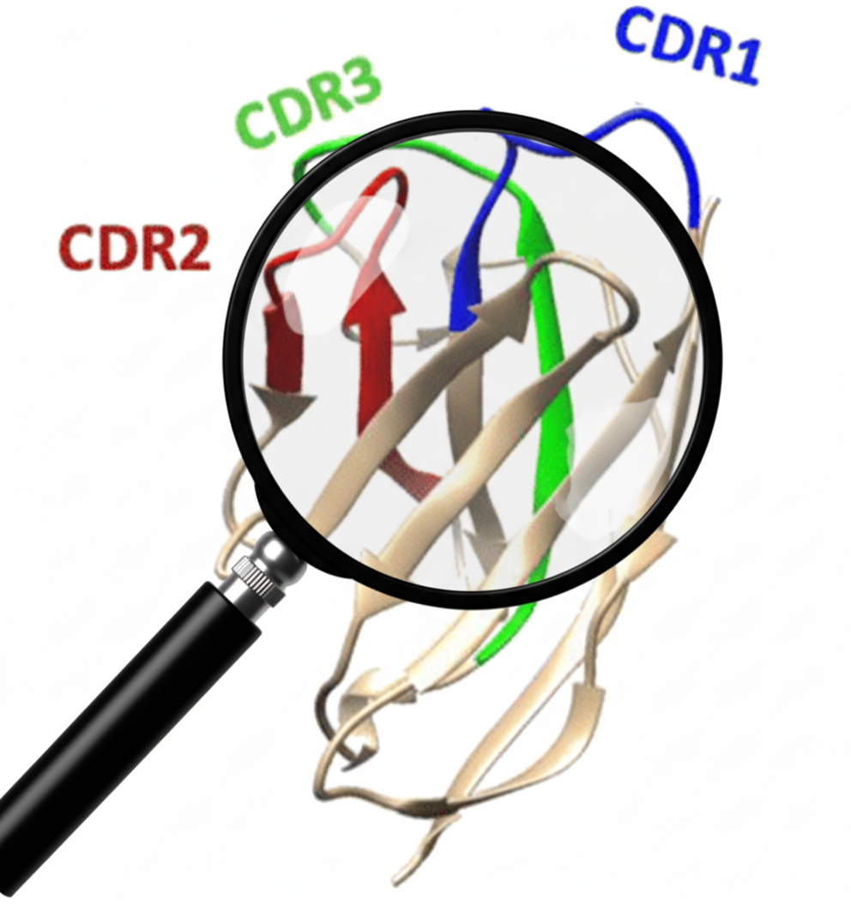
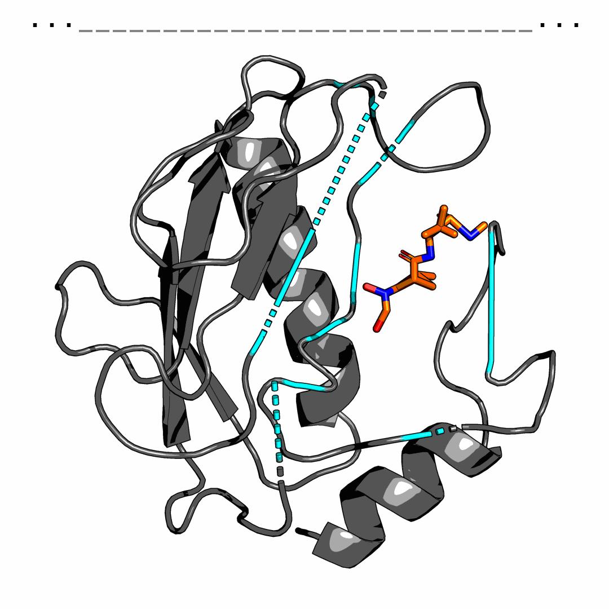
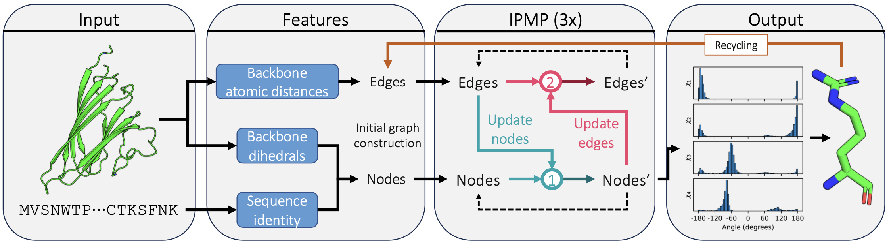
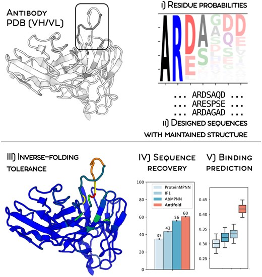
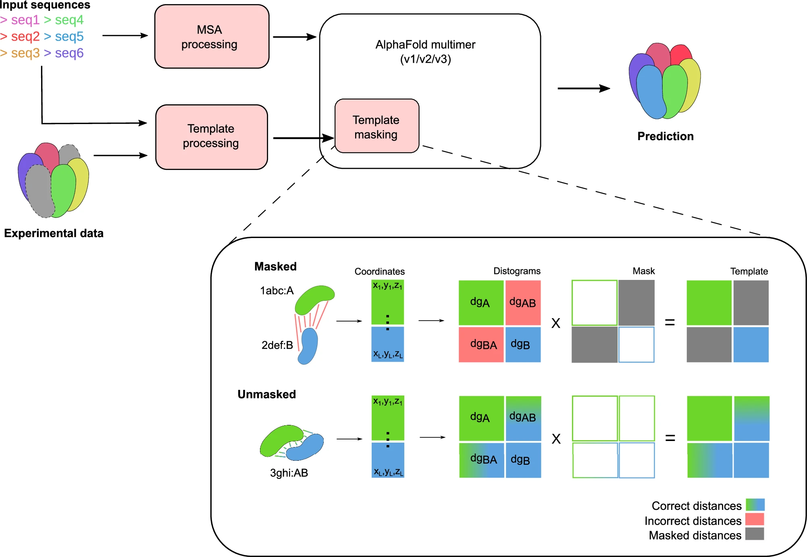

[Background image source](https://www.independent.co.uk/travel/europe/slovenia/nova-gorica-slovenia-italy-capital-of-culture-b2712344.html)

# *De Novo* Nanobody Design

This repository contains the computational workflow for the *de novo* (re)design of a nanobody to specific target protein of interest.
The pipeline is developed to use Google Colab resources and it is adequate for people with little knowledge on protein *de novo* design tools and limited structural biology background.
It is actually made for demonstration and teaching, while being not adequate to scale for a production-level *in silico* screening 

This material has been used during the **Nanobody Workshop (22-26 Sep 2025)**.
*   **Event Link:** [https://indico.ijs.si/event/2966/](https://indico.ijs.si/event/2966/)
* A brief introduction on AI-assisted protein design is available at this [link](./Misc/AI-assited_design.ppt)

## Overview

The workshop starts from the 3D structure of two input PDBs, one of the target and one of the scaffold nanobody. The steps are performed using Google Colab notebooks, provided in this repository.

**Note on File Access:** The links to files in this README (like `7z1b.pdb`) are relative paths. If you click on them in a browser while logged into GitHub with access to this repository, you will see the file's content. To use the file, you will need to manually click the "Download raw file"  top-right button on the file viewer page.

## Target and nanobody scaffold files

*   **Target:** An arbitrary protein structure (in PDB format) of your choice.
    *   **Example Target (SarsCov2 RBD):** [7z1b.pdb](./Example_input/7z1b.pdb)
*   **Scaffold:** A pre-selected nanobody structure to serve as the starting point for the (re)design.
    *   **Example nanobody scaffold:** [nanobody_scaffold.pdb](./Example_input/nanobody_scaffold.pdb)
---
### 1. Candidate epitopes Prediction and nanobody CDRs identification

<table>
  <tr>
    <td align="center">
      
       
      <em>Fetching target antigen patches</em>
    </td>
    <td align="center">
      
       
      <em>Fetching nanobody complementary determining regions (CDRs)</em>
    </td>
  </tr>
</table>

*   **Tools:** [Quilt](https://github.com/plijnzaad/quilt) and [Nanocdr-x](https://github.com/lescailab/nanocdr-x)
*   **Purpose:** This analysis serves two main purposes:
    *   To predict potential epitopes on the surface of the target protein. These regions must have a sufficient area to be involved in protein-protein interactions and with hydrophobic propensity, as these features are ideal for *de novo* targeting.
    *   To identify and extract the complementary-determining regions (CDRs) from nanobody sequences.
*   **Colab Notebook:** 
*   **Example output:** The file containing annotations of target patches and CDRs ("Step_1_annotations.txt") and the input PDB of nanobody with CDRs pre-annotated ("nanobody_scaffold_with_CDRs.pdb").
    *   **Annotation File:** [Step_1_annotations.txt](./Example_output/Step_1_annotations.txt)
    *   **Nanobody PDB File:** [nanobody_scaffold_with_CDRs.pdb](./Example_output/nanobody_scaffold_with_CDRs.pdb)
---
### 2. *Nanobody de novo* CDRs Design

<table>
  <tr>
    <td align="center">
      
       
      <em>RFDiffusion sampling for binder design</em>
    </td>
  </tr>
</table>

[image source](https://www.kjfold.com/en/category/83.html)

*   **Tool:** RFantibody [paper link](https://www.biorxiv.org/content/10.1101/2024.03.14.585103v2)
*   **Purpose:** To design alternative complete CDR conformations. The CDRs are the most variable parts of the nanobody and are primarily responsible for binding to the target. You have the possibility also to annotate nanobody residues (but not side-chains!) potentially involved in contacts with the epitope.
*   **Colab Notebook:** 
*   **Example output:** the backbone structure of the complex between the (re)designed nanobody interacting with the target protein antigen ("Nanobody_Design_0.pdb") at the specified patch (designated in step 1), with interacting nanobody residues annotated ("Interacting_residues_Nanobody_Design_0.txt").
    *   **Structure Design:** [Nanobody_Design_0.pdb](./Example_output/Nanobody_Design_0.pdb)
    *   **Annotation:** [Interacting_residues_Nanobody_Design_0.txt](./Example_output/Interacting_residues_Nanobody_Design_0.txt)

---   
### 3. Fixed-backbone Sequence reconstruction of nanobody interfacial residues

<table>
  <tr>
    <td align="center">
      
       
      <em>An example of structure-based sequence design</em>
    </td>
  </tr>
</table>

[image source](https://github.com/zaixizhang/PocketGen)

*   **Tool:** ProteinMPNN [paper link](https://www.science.org/doi/10.1126/science.add2187)
*   **Purpose:** To reconstruct the sequence of CDRs and FWs regions at the nanobody-target interface. This step is necessary to rebuild a 3D model, as RFantibody masks interfacial residues as glycines (it is focused on backbone reconstruction, it did not generate full atoms models!).
*   **Colab Notebook:** 
*   **Example output:** the backbone structure of the complex between the (re)designed nanobody interacting with the target protein antigen with optimized CDRs and FRs at the interface ("design_15_model.pdb").
    *   **Structure Design with ProteinMPNN redesigned interface:** [design_15_model.pdb](./Example_output/design_15_model.pdb)

---
### 4. Side-chain packing of ProteinMPNN optimized design

<table>
  <tr>
    <td align="center">
      
       
      <em>Building side-chain atoms and pack them (predict torsion chi angles)</em>
    </td>
  </tr>
</table>

[image source](https://onlinelibrary.wiley.com/doi/10.1002/prot.26705)

*   **Tool:** PIPPack [paper link](https://onlinelibrary.wiley.com/doi/10.1002/prot.26705)
*   **Purpose:** To build and optimize the side-chains atoms of the ProteinMPNN optimized design.
*   **Colab Notebook:** 
*   **Example output:** the full atom backbone structure of the complex between the (re)designed nanobody interacting with the target protein antigen with optimized CDRs and FRs at the interface ("design_15_model_pippack_ensemble.pdb").
    *   **Full-atom structure of ProteinMPNN redesign with repacked side-chains:** [design_15_model_pippack_ensemble.pdb](./Example_output/design_15_model_pippack_ensemble.pdb)

---
### 5. CDRs Sequence Reconstruction with a CDR-specialized model

<table>
  <tr>
    <td align="center">
      
       
      <em>CDRs sequence optimization</em>
    </td>
  </tr>
</table>

[image source](https://doi.org/10.1093/bioadv/vbae202)

*   **Tool:** AntiFold [paper link](https://academic.oup.com/bioinformaticsadvances/article/5/1/vbae202/8090019)
*   **Purpose:** To reconstruct the sequence of CDRs regions with a CDR-specialized model. This step is necessary to get the final nanobody design sequence to build a final 3D model with optimized CDRs.
*   **Colab Notebook:** 
*   **Example output:** the final nanobody design sequence with the best score (the lower the better in this case!). The sequence is in a fasta file togheter with the sequence of the antigen, ready for the next step ("design_3_score_0.4895.fasta").
    *   **Fasta sequence of the nanobody after optimized CDRs:** [design_3_score_0.4895.pdb](./Example_output/design_3_score_0.4895.fasta)

---
### 6. Complex Reprediction for Quality Assessment

<table>
  <tr>
    <td align="center">
      
       
      <em>Example of unmasking AlphaFold template information over protein complexes given at input</em>
    </td>
  </tr>
</table>

[image source](https://www.nature.com/articles/s41467-024-52951-w)

*   **Tool:** gapTrick [paper link](https://www.biorxiv.org/content/10.1101/2025.01.31.635911v2)
*   **Purpose:** To use the top scoring AntiFold nanobody sequence for getting the full-atom 3D model of the *de novo* designed nanobody-target complex. This step assesses the quality of the designed interfacial residues and identifies key non-covalent contacts (e.g., hydrophobic contacts, hydrogen bonds, salt bridges) if AlphaFold "thinks" they exist. Inputs are the output of previous step and the PDB output of step 4 ([design_15_model_pippack_ensemble.pdb](./Example_output/design_15_model_pippack_ensemble.pdb)) that will be used as template to help in the prediction
*   **Colab Notebook:** 
*   **Example output:** the final pdb of the nanobody design ("ranked_0.pdb"). The interface in Google Colab will provide info on the existence of reliable inter-protein contacts, displayed in a distogram ("distogram.png").
    *   **Repredicted Structure of the CDRs-optimized design:** [ranked_0.pdb](./Example_output/ranked_0.pdb)
    *   **Distogram to assess reliable inter-protein contacts:** [ranked_0.pdb](./Example_output/ranked_0.pdb)

---
## 7. Screening and Further Validation of *de novo* designed nanobody binders

Further steps of validation are crucial for increasing the likelihood of success in experimental settings, both *in vitro* and *in vivo*.
In order to have a sufficient n° of designs for a successful experimental screening, it is advisable to generate at least **≈1000** *in silico* designs (full-atom structure) and use them as input to pass further validation and filtering steps, as these will likely result in 95% of designs to fail leaving your computer.
These steps may use one or more of the following (the list of options for each approach is not comprehensive, it is just for giving some examples):

*   **Interaction confidence from deep learning approaches**
    *   Use AlphaFold2 (AF2), AlphaFold-Multimer or AF3 to repredict the complex without the use of templates (used by gapTrick) and evaluate the models for consistency with the design structure and fexibility-sensitive confidence scores( e.g, [Local Interaction Score](https://github.com/flyark/AFM-LIS) or [ipSAE](https://doi.org/10.1101/2025.02.10.637595))
*   **Empirical-physics scores:**
    *   Protein-protein docking scores (e.g., HADDOCK, Rosetta-ddG, Fold-X)
    *   Geometric scores using surface and non-covalent interactions features at interface (e.g., Rosetta interface analysis tools, dG/dSASA, packstat or n° unsaturated H-bonds)
*   **Physics-based Assessment:**
    *   Molecular Dynamics simulations (> 100 ns) to assess complex stability (e.g., RMSD metric using GROMACS, AMBER, etc...)
    *   Enhanced sampling methods, to generate the conformational free-energy landscape (e.g., metadynamics with PLUMED or coarse-grained/all-atom hybrid simulations with Prody)
*   **Developability Assessment (To be compared with the initial Nb scaffold if it is known it has a good developability):**
    *   Solubility prediction
    *   Stability Prediction 
    *   Aggregation propensity
    *   Propension for off-target antigenic interactions

---
## Acknowledgements

Most of the Google colaboratories were developed by customizing other colabs, referenced in the corresponding file. I linked the paper or the original source describing all the different methods. This repo was written with help of [Google Gemini-CLI](https://github.com/google-gemini/gemini-cli).

## Contact

For any questions, suggestions, or issues, please open an issue in this GitHub repository or contact me at [marco.orlando1991@live.it](mailto:marco.orlando1991@live.it) or [marco.orlando1991@ung.si](mailto:marco.orlando@ung.si).
